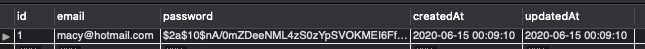

# ReverseEngineeringAuthentication
## Unit 14 Sequelize: Reverse Engineering Code

#### ***config*** -- Contains the following files:
1. *middleware* contains:

- *isAuthenticated.js* 

2. *config.json* 

3. *passport.js* 

#### ***models*** -- Contains the following files:
- *index.js* - 

- *user.js* - 

*example of a hashed password*

#### ***public*** -- Contains the following files:
1.  *js* contains:
- *login.js* -

- *members.js* - 

- *signup.js* - 

2. *stylesheets* contains:

- *style.css* 

3. *login.html* 

4. *members.html* 

5. *signup.html* 